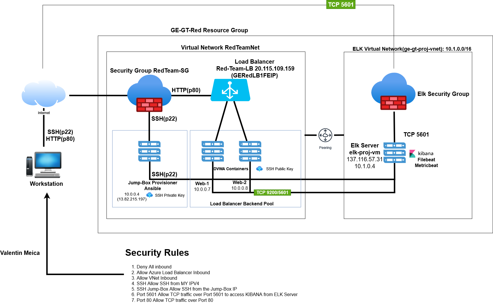
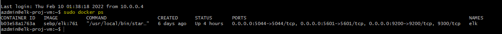

# Elk-Stack-Project
GT-CyberBootcamp elk stack deployment project

## Automated ELK Stack Deployment

The files in this repository were used to configure the network depicted below.

These files have been tested and used to generate a live ELK deployment on Azure. They can be used to either recreate the entire deployment pictured above. Alternatively, select portions of the yml and config file may be used to install only certain pieces of it, such as Filebeat.

* [My First Playbook](Ansible/pentest.yml "My First Playbook")

This document contains the following details:
- Description of the Topologu
- Access Policies
- ELK Configuration
  - Beats in Use
  - Machines Being Monitored
- How to Use the Ansible Build

### Description of the Topology

The main purpose of this network is to expose a load-balanced and monitored instance of DVWA, the D*mn Vulnerable Web Application.

Load balancing ensures that the application will be highly **_functional and available_**, in addition to restricting **_traffic_** to the network.
- What aspect of security do load balancers protect? What is the advantage of a jump box?_
  
  - **_Load balancers add resiliency by rerouting live traffic from one server to another if a server falls prey to a DDoS attack or otherwise becomes unavailable._**
  - **_A Jump Box Provisioner is also important as it prevents Azure VMs from being exposed via a public IP Address. This allows us to do monitoring and logging on a single box. We can also restrict the IP addresses able to communicate with the Jump Box, as we've done here._**

Integrating an ELK server allows users to easily monitor the vulnerable VMs for changes to the _____ and system _____.
- What does Filebeat watch for?_
  - **_Filebeat monitors the log files or locations specified, collects log events, and forwards them either to Elasticsearch or Logstash for indexing._**
- What does Metricbeat record?_
  - **_Metricbeat takes the metrics and statistics that it collects and ships them to the output that you specify, such as Elasticsearch or Logstash._**

The configuration details of each machine may be found below.
_Note: Use the [Markdown Table Generator](http://www.tablesgenerator.com/markdown_tables) to add/remove values from the table_.

| Name                 | Function      | IP Address                | Operating System     |
|----------------------|---------------|---------------------------|----------------------|
| Jump-Box-Provisioner | Gateway       | 10.0.0.4 / 13.92.171.72   | Linux (ubuntu 18.04) |
| Red-Web1             | Ubuntu Server | 10.0.0.7 / 20.115.109.159 | Linux (ubuntu 18.04) |
| Red-Web2             | Ubuntu Server | 10.0.0.8 / 20.115.109.159 | Linux (ubuntu 18.04) |
| elk-proj-vm          | Ubuntu Server | 10.1.0.4 / 137.116.57.31  | Linux (ubuntu 18.04) |

### Access Policies

The machines on the internal network are not exposed to the public Internet. 

Only the **_Jump-Box-Provisioner_** machine can accept connections from the Internet. Access to this machine is only allowed from the following IP addresses:
  - **_Workstation MY Public IP through TCP 5601._**

Machines within the network can only be accessed by **_Workstation and Jump-Box-Provisioner through SSH Jump-Box._**.

- Which machine did you allow to access your ELK VM?
  - **_Jump-Box-Provisioner IP : 10.0.0.4 via SSH port 22_**
- What was its IP address?
  - **_Workstation MY Public IP via port TCP 5601_**
 
A summary of the access policies in place can be found in the table below.

| Name                 | Publicly Accessible | Allowed IP Addresses                    |
|----------------------|---------------------|-----------------------------------------|
| Jump-Box-Provisioner | Yes                 | 13.92.171.72 (Workstation IP on SSH 22) |
| Red-Web1             | No                  | 10.0.0.4 on SSH 22                      |
| Red-Web2             | No                  | 10.0.0.4 on SSH 22                      |
| elk-proj-vm          | No                  | Workstation MY Public IP using TCP 5601 |

### Elk Configuration

Ansible was used to automate configuration of the ELK machine. No configuration was performed manually, which is advantageous because...
-  What is the main advantage of automating configuration with Ansible?_
  - **_Ther are multiple advantages, Ansible lets you quickly and easily deploy multitier applications throug a YAML playbook._**
  - **_You don't need to write custom code to automate your systems._**
  - **_Ansible will also figure out how to get your systems to the state you want them to be in._**

The playbook implements the following tasks:
-  In 3-5 bullets, explain the steps of the ELK installation play. E.g., install Docker; download image; etc._
  - Install Docker.io
  - Install pip3
  - Install Docker python module
  - Use more memory
  - download and launch a docker elk container
  - Enable service docker on boot

The following screenshot displays the result of running `docker ps` after successfully configuring the ELK instance.

### Target Machines & Beats
This ELK server is configured to monitor the following machines:
-  List the IP addresses of the machines you are monitoring_
  - Red-Web1: 10.0.0.7 / 20.115.109.159
  - Red-Web2: 10.0.0.8 / 20.115.109.159

We have installed the following Beats on these machines:
-  Specify which Beats you successfully installed_
  - Filebeat
    - [Filebeat Module Status Screenshot](Diagrams/Filebeat_data_successful.jpg "Filebeat Data Successful")

- Metricbeat
  - These Beats allow us to collect the following information from each machine:

-  In 1-2 sentences, explain what kind of data each beat collects, and provide 1 example of what you expect to see. E.g., `Winlogbeat` collects Windows logs, which we use to track user logon events, etc._

  - Filebeat will be used to collect log files from very specific files such as Apache, Microsft Azure tools and web servers, MySQL databases.
  - Metericbeat will be used to monitor VM stats, per CPU core stats, per filesystem stats, memory stats and network stats.

### Using the Playbook
In order to use the playbook, you will need to have an Ansible control node already configured. Assuming you have such a control node provisioned: 

SSH into the control node and follow the steps below:
- Copy the **_yml_** file to **_ansible folder._**
- Update the **_config_** file to include **_remote users and ports._**
- Run the playbook, and navigate to  **_Kibana ((Your IP Address):5601_)** to check that the installation worked as expected.

 Answer the following questions to fill in the blanks:_
- _Which file is the playbook? Where do you copy it?_

- _Which file do you update to make Ansible run the playbook on a specific machine? 
  - **_/etc/ansible/hosts file (IP of the Virtual Machines)._**
- How do I specify which machine to install the ELK server on versus which to install Filebeat on?_
  - **_Two separate groups need to be specified in the etc/ansible/hosts file. One group for the webservers that have the IPs of the 2 VMs that Filebeat is installed on. The other group is named ELKserver with the IP of the VM ELK is installed on._**  
- _Which URL do you navigate to in order to check that the ELK server is running?
  - **_http://[ELK VM PUBLIC IP]:5601//app/kibana_**

_As a **Bonus**, provide the specific commands the user will need to run to download the playbook, update the files, etc._

|            COMMAND                               | PURPOSE                                               |
|--------------------------------------------------|-------------------------------------------------------|                         
|`ssh-keygen`                                      |  create a ssh key for setup VM's                      |
|`sudo cat .ssh/id_rsa.pub`                        |  to view the ssh public key                           |
|`ssh azadmin@Jump-Box-Provisioner IP address`     |  to log into the Jump-Box-Provisioner                 |
| `sudo docker container list -a`                  |  list all docker containers                            |
| `sudo docker start [CONTAINER NAME]`             |  start docker container                  |
|`sudo docker ps -a`                               |  list all active/inactive containers                  |
|`sudo docker attach [CONTAINER NAME]`               |  effectively sshing into the dremy_elbakyan container |
|`cd /etc/ansible`                                 | Change directory to the Ansible directory             |
|`ls -laA`                                         | List all file in directory (including hidden)         |
|`nano /etc/ansible/hosts`                         |  to edit the hosts file                               |
|`nano /etc/ansible/ansible.cfg`                   |  to edit the ansible.cfg file                         |
|`nano /etc/ansible/pentest.yml`                   |  to edit the My-Playbook                              |
|`ansible-playbook [location][filename]`           |  to run the playbook                                  |
|`sudo lsof /var/lib/dpkg/lock-frontend`           | unlocking a locked file                               |
|`ssh ansible@Web-1 IP address`                    |  to log into the Web-1 VM                             |
|`ssh ansible@Web-2 IP address`                    |  to log into the Web-2 VM                             |
|`ssh ansible@ELKserver IP address`                |  to log into the ELKserver VM                         |
|`exit`                                            | to exit out of docker containers/Jump-Box-Provisioners|
|`nano /etc/ansible/ansible.cfg`                   |  to edit the ansible.cfg file                         |
|`nano /etc/ansible/hosts`                         |  to edit the hosts file                               |
|`nano /etc/ansible/pentest.yml`                   |  to edit the My-Playbook                              |
|`ansible-playbook [location][filename]`           |  to run the playbook                                  |
|`sudo apt-get update` 				                     |  this will update all packages                        |
|`sudo apt install docker.io`				               |  install docker application		                       |
|`sudo service docker start`				               |  start the docker application                         |
|`sudo systemctl status docker`				             |  status of the docker application                     |
|`sudo systemctl start docker`                     |  start the docker service                             |
|`sudo docker pull cyberxsecurity/ansible`	       |  pull the docker container file                       |
|`sudo docker run -ti cyberxsecurity/ansible bash` |  run and create a docker container image              |
|`ansible -m ping all`                             |  check the connection of ansible containers           |
|`curl -L -O [location of the file on the web]`    |  to download a file from the web                      |
|`dpkg -i [filename]`                              |  to install the file i.e. (filebeat & metricbeat)     |
|`http://[ELK VM PUBLIC IP]//app/kibana`           | Open web browser and navigate to Kibana Logs          |
|`nano filebeat-config.yml`                        | create and edit filebeat config file                  |
|`nano filebeat-playbook.yml`                      | write YAML file to install filebeat on webservers     |
|`nano metricbeat-config.yml`                      | create metricbeat config file and edit it             |
|`nano metricbeat-playbook.yml`                    | write YAML file to install metricbeat on webservers   |  
------------------------------------------------------------------------------------------------------------